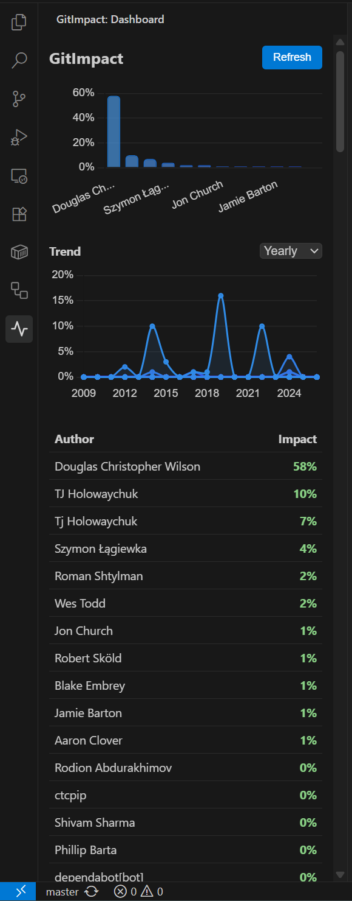
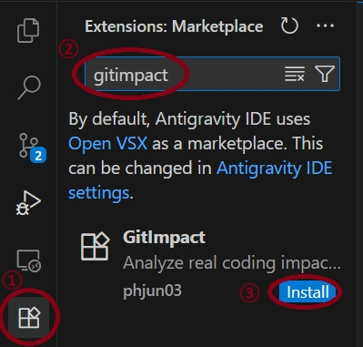
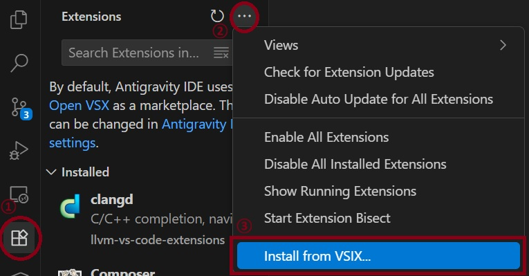

# GitImpact




GitImpact is a Visual Studio Code extension that measures the *true* impact of code contributions. Instead of merely counting raw lines of code, it applies **Information Theory (Shannon Entropy)** to filter out noise, boilerplate, and empty lines, delivering a highly accurate metric of meaningful code complexity.

## Requirements

- **Git**: Must be installed on your local machine.
- **Remote Sync**: The repository must be linked to a remote (e.g., GitHub) and synced. The extension analyzes code based on the remote branch to ensure authenticity.

## Features

- **Surviving Code Analysis**: Uses `git blame` to analyze only the code that currently survives in your remote repository (GitHub). Deleted or refactored code is accurately excluded.
- **Noise Filtering**: Automatically ignores whitespace, brackets, and auto-generated boilerplates.
- **Shannon Entropy Scoring**: Calculates the information density (entropy) of added tokens. Complex algorithms score higher than simple repetitive lines.
- **Time-Series Activity Bar Dashboard**: View team rankings and historical impact trends directly inside your VS Code Sidebar.
- **Auto-Refresh**: Automatically detects when you sync with your remote (e.g., `git pull`, `git push`, `git fetch`) and updates the dashboard.

## Installation

### Via Extension Marketplace (Recommended)
You can install GitImpact directly from the official VS Code Marketplace or Open VSX Registry (for VSCodium, Cursor, etc.).



1. Open your editor and navigate to the **Extensions** view (`Ctrl+Shift+X`).
2. Search for **GitImpact**.
3. Click **Install**.

*Direct Links:*
- [VS Code Marketplace](https://marketplace.visualstudio.com/items?itemName=PHJun03.git-impact)
- [Open VSX Registry](https://open-vsx.org/extension/phjun03/git-impact)

### Manual Installation (VSIX)



1. Download the latest `git-impact-*.vsix` file from the [Releases](../../releases) page.
2. Open VS Code and navigate to the **Extensions** view (`Ctrl+Shift+X`).
3. Click the **...** (Views and More Actions) menu at the top right.
4. Select **Install from VSIX...**
5. Locate the downloaded file and install.

## How to Use

1. Open a valid Git repository in VS Code (make sure your latest commits are pushed to the remote).
2. Click on the 📈 **GitImpact** icon in the Activity Bar on the left side of the screen.
3. The extension will generate a beautiful line chart and leaderboard showing the *true* impact of each contributor!

## Development & Building

To build the VSIX package yourself:

```bash
# 1. Install dependencies
npm install

# 2. Package into a .vsix file
npx @vscode/vsce package
```

## How it works (Formula)

```
impactScore = meaningfulLines × H(tokens) × (1 + complexityBonus)
```
*Where `H(tokens)` is the Shannon entropy of the code token distribution.*
*Scores are normalized so the total team impact equals 100%.*
